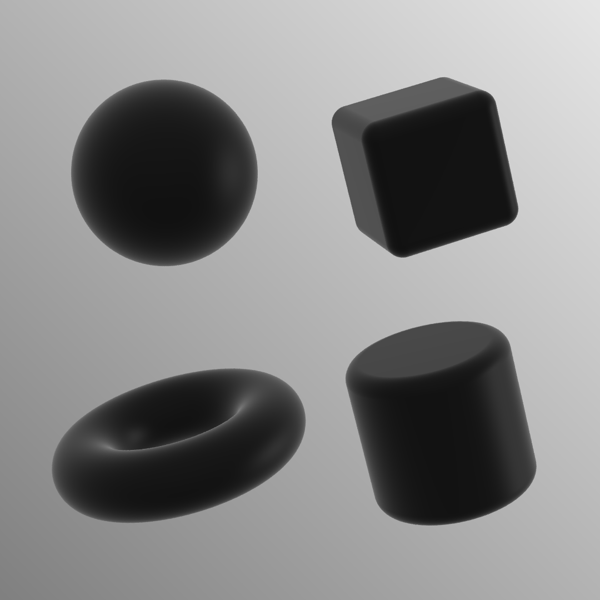
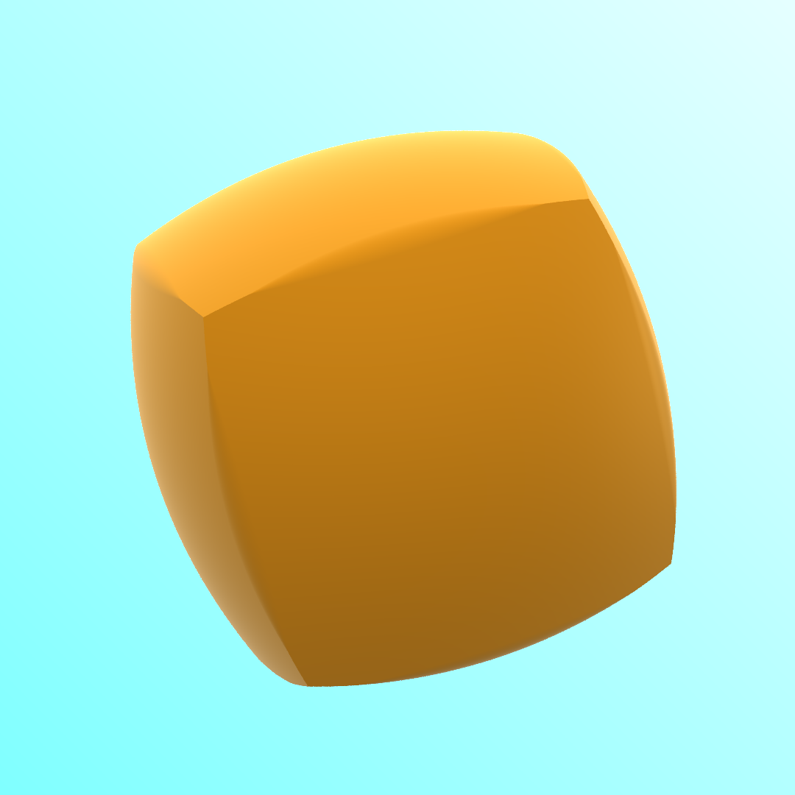

# Tinymarch
## A Small CPU Ray Marcher Written in Rust

Multi-threaded using [Rayon](https://docs.rs/rayon/latest/rayon/)

Reworked to mirror structure of my [Shadertoy ray marcher](https://www.shadertoy.com/view/dtXfzM).

---
### About Ray Marching

Ray marching is a rendering technique similar to ray tracing that relies on a different method of finding the intersection between the ray and rendered geometry. This method is usually used to render geometry created with Signed Distance Fields (SDFs) rather than polygons.

Originating from the camera, each ray "marches" through the scene, evaluating the SDF at each step to determine how far it can safely travel without running into anything. See my [Shadertoy demo](https://www.shadertoy.com/view/cssfWs) for a 2D breakdown of how it works.

---
This ray marcher renders an SDF scene defined in the eval() function. Below is a sample scene defined as follows:

```rust
fn eval(p) -> f64 {
    let s1 = _sphere(p, point![0.0, 0.0, 0.0], 1.);
    let s2 = _sphere(p, point![1., -0.6, -1.], 0.9);
    return _smooth_subtraction(s1, s2, 0.05);
}
```

The resolution and number of samples (for anti-aliasing) are specified in render() in main.rs:
```rust
render(x_res, y_res, sample_count);
```

When compiled and run, the image will be rendered to `output.png`

```
cargo run --release
```

---


The shading is a simple setup designed to look nice but not physically accurate. This can be changed by modifying the `simple_shading()` and `sky()` functions.

Certain SDFs may present artifacts when ray marching, such as "bound" or non-exact SDFs and SDFs with union/subtraction/intersections in some cases. To improve the quality of the render, adjusting the ray marching constants may help.

```rust
pub const MAX_STEPS: usize = 500;   // Maximum number of ray marching steps
pub const MAX_DIST: f64 = 100.;     // Maximum distance for ray marching
pub const SURF_DIST: f64 = 0.0001;  // SDF value that registers a "hit"
pub const STEP_SCALE: f64 = 1.0;    // Modified step scale to help prevent artifacts (<=1)
```
---
Some primitive shapes:

Linear interpolation between a sphere and a box:

---
Most of the distance functions are based on Inigo Quilez's (iq) shaders & functions https://iquilezles.org/.

(Learning from the mistakes of an over-engineered version that didn't work as well)

References
- https://learnopengl.com/PBR/Lighting
- https://iquilezles.org/articles/distfunctions/
- https://www.youtube.com/watch?v=PGtv-dBi2wE
- https://www.youtube.com/watch?v=BNZtUB7yhX4