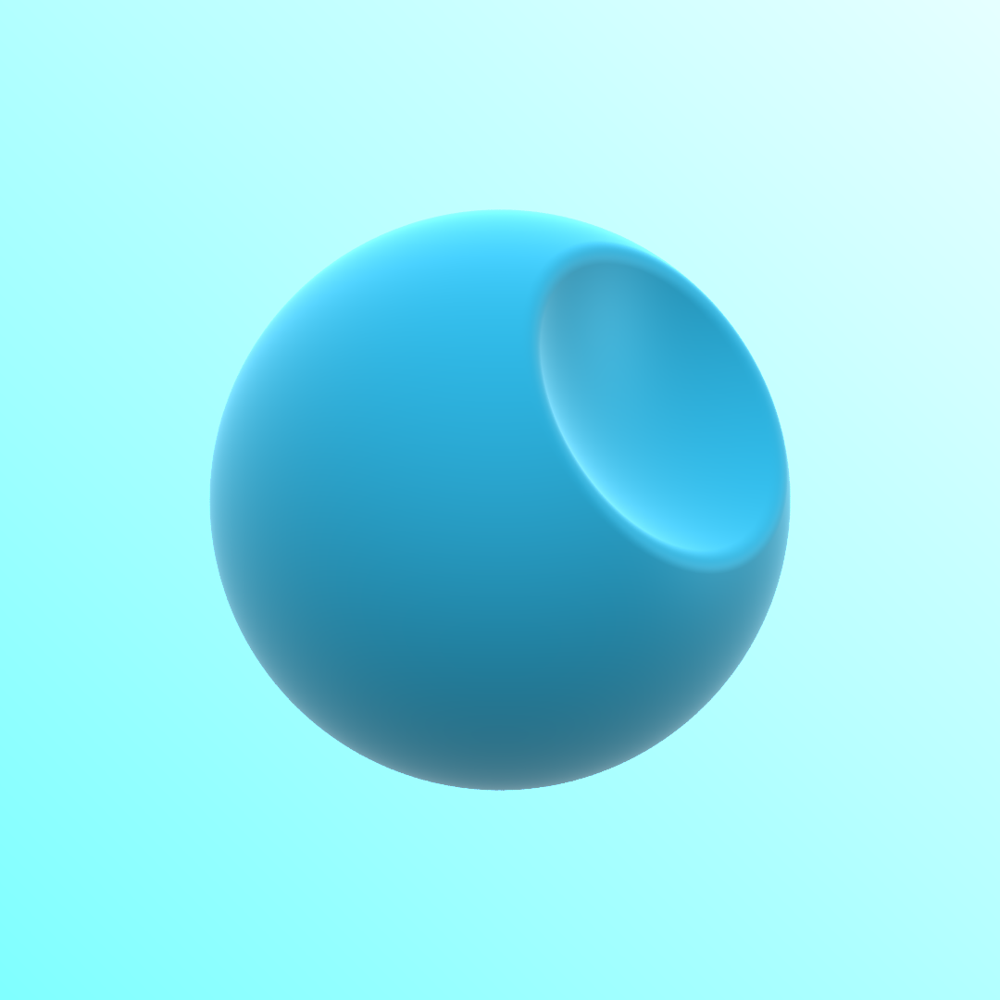

# Tinymarch
## A small ray marcher written in Rust

Reworked to mirror structure of my [shadertoy ray marcher](https://www.shadertoy.com/view/dtXfzM).

This ray marcher renders an SDF scene defined in the eval() function. Below is a sample scene defined as follows:

```rust
fn eval(p) -> f64 {
    let s1 = _sphere(p, point![0.0, 0.0, 0.0], 1.);
    let s2 = _sphere(p, point![1., -0.6, -1.], 0.9);
    return _smooth_subtraction(s1, s2, 0.05);
}
```



The shading is a simple setup designed to look nice but not physically accurate. This can be changed by modifying the `simple_shading()` and `sky()` functions.

Certain SDFs may present artifacts when ray marching, such as "bound" or non-exact SDFs and SDFs with union/subtraction/intersections in some cases. To improve the quality of the render, adjusting the ray marching constants may help.

```rust
pub const MAX_STEPS: usize = 500;   // Maximum number of ray marching steps
pub const MAX_DIST: f64 = 100.;     // Maximum distance for ray marching
pub const SURF_DIST: f64 = 0.0001;  // SDF value that registers a "hit"
pub const STEP_SCALE: f64 = 1.0;    // Modified step scale to help prevent artifacts (<=1)
```


---


Most of the distance functions based on Inigo Quilez's (iq) shaders & functions https://iquilezles.org/.

(Learning from the mistakes of an over-engineered version that didn't work as well)


References
- https://learnopengl.com/PBR/Lighting
- https://iquilezles.org/articles/distfunctions/
- https://www.youtube.com/watch?v=PGtv-dBi2wE
- https://www.shadertoy.com/view/7djcDz